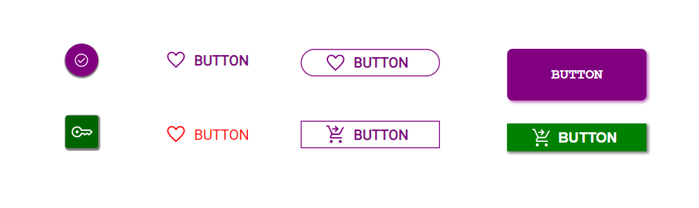
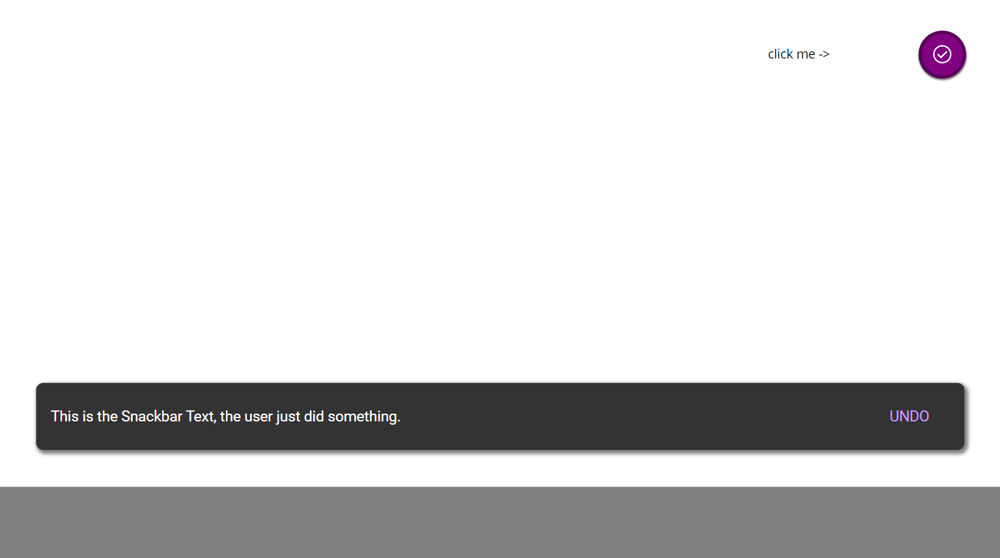
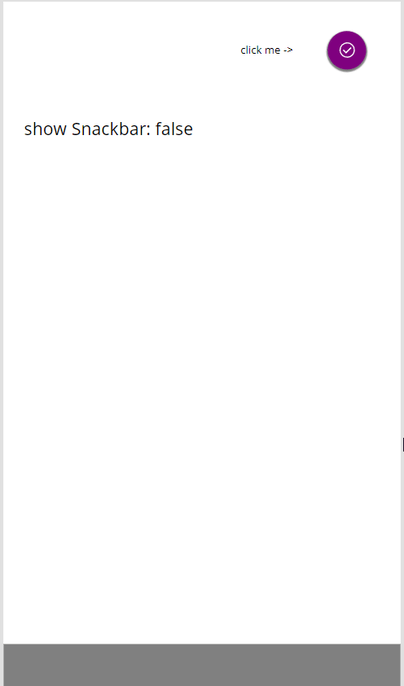
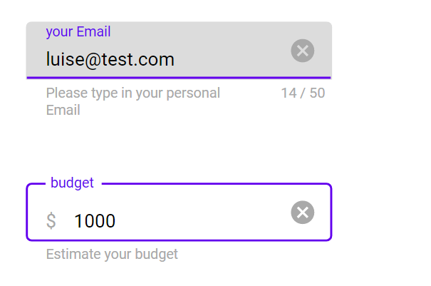

# PowerApps-MaterialDesign

UI Toolkit for Microsoft Power Apps that aims to represent the look & feel of [Google Material Design](https://material.io/components).

## Components

### App bar top


#### App bar (top) custom properties

- **secondaryColor** `ColorValue("#4C00D5")`
- **accentColor**: `ColorValue("#6200EE")`
- **icon**: (Hamburger)

`"data:image/svg+xml;utf8, "&EncodeUrl("<svg xmlns='http://www.w3.org/2000/svg' viewBox='0 0 24 24'>
           <path fill='"&cmp_MD_AppBar_top.iconColor&"' d='M3,6H21V8H3V6M3,11H21V13H3V11M3,16H21V18H3V16Z'/>
        </svg>
        ")`

- **icon2**: (Share)

`"data:image/svg+xml;utf8, "&EncodeUrl("<svg xmlns='http://www.w3.org/2000/svg' viewBox='0 0 24 24'>
           <path fill='"&cmp_MD_AppBar_top.iconColor&"' d='M18,16.08C17.24,16.08 16.56,16.38 16.04,16.85L8.91,12.7C8.96,12.47 9,12.24 9,12C9,11.76 8.96,11.53 8.91,11.3L15.96,7.19C16.5,7.69 17.21,8 18,8A3,3 0 0,0 21,5A3,3 0 0,0 18,2A3,3 0 0,0 15,5C15,5.24 15.04,5.47 15.09,5.7L8.04,9.81C7.5,9.31 6.79,9 6,9A3,3 0 0,0 3,12A3,3 0 0,0 6,15C6.79,15 7.5,14.69 8.04,14.19L15.16,18.34C15.11,18.55 15.08,18.77 15.08,19C15.08,20.61 16.39,21.91 18,21.91C19.61,21.91 20.92,20.61 20.92,19A2.92,2.92 0 0,0 18,16.08Z' />
        </svg>
        ")`

- **icon3**: (Search)

`"data:image/svg+xml;utf8, "&EncodeUrl("<svg xmlns='http://www.w3.org/2000/svg' viewBox='0 0 24 24'>
           <path fill='"&cmp_MD_AppBar_top.iconColor&"' d='M9.5,3A6.5,6.5 0 0,1 16,9.5C16,11.11 15.41,12.59 14.44,13.73L14.71,14H15.5L20.5,19L19,20.5L14,15.5V14.71L13.73,14.44C12.59,15.41 11.11,16 9.5,16A6.5,6.5 0 0,1 3,9.5A6.5,6.5 0 0,1 9.5,3M9.5,5C7,5 5,7 5,9.5C5,12 7,14 9.5,14C12,14 14,12 14,9.5C14,7 12,5 9.5,5Z' />
        </svg>
        ")`

- **icon4**: (Context/Kebab)

`"data:image/svg+xml;utf8, "&EncodeUrl("<svg xmlns='http://www.w3.org/2000/svg' viewBox='0 0 24 24'>
           <path fill='"&cmp_MD_AppBar_top.iconColor&"' d='M12,16A2,2 0 0,1 14,18A2,2 0 0,1 12,20A2,2 0 0,1 10,18A2,2 0 0,1 12,16M12,10A2,2 0 0,1 14,12A2,2 0 0,1 12,14A2,2 0 0,1 10,12A2,2 0 0,1 12,10M12,4A2,2 0 0,1 14,6A2,2 0 0,1 12,8A2,2 0 0,1 10,6A2,2 0 0,1 12,4Z' />
        </svg>
        ")`

- **iconColor**: `"#FFFFFF"` - used in SVG code to determine color of icons
- **mockVisible**: `false` - used to determine if battery/wifi mock icons are visible
- **onSelectContext**: `true` - behavior property on Kebab icon
- **onselectMenu**: `true` - behavior property on Hamburger icon
- **onSelectSearch**: `true` - behavior property on Search icon
- **onselectShare**: `true` - behavior property on Share icon
- **textColor**: `White` - determines text color
- **font**: `"Roboto"` - determines font
- **titleText**: `Photos` - determines title text

#### App bar (top) dimensions

- **Width**: `App.DesignWidth`
- **Height**: `120`
- **X**: `0`
- **Y**: `0`

### Navigation (bottom)


#### Navigation (bottom) custom properties

- **navContent**:

```powerappsfl
Table(
    {
        id: 1,
        title: "Favorites",
        image: "data:image/svg+xml;utf8, " & EncodeUrl(
            "<svg xmlns='http://www.w3.org/2000/svg' viewBox='0 0 24 24'>
   <path fill='" & cmp_MD_Bottom_Navigation.iconColor & "' d='M12,21.35L10.55,20.03C5.4,15.36 2,12.27 2,8.5C2,5.41 4.42,3 7.5,3C9.24,3 10.91,3.81 12,5.08C13.09,3.81 14.76,3 16.5,3C19.58,3 22,5.41 22,8.5C22,12.27 18.6,15.36 13.45,20.03L12,21.35Z' />
</svg>"
        ),
        imageHover:         "data:image/svg+xml;utf8, " & EncodeUrl(
            "<svg xmlns='http://www.w3.org/2000/svg' viewBox='0 0 24 24'>
   <path fill='"&cmp_MD_Bottom_Navigation.iconHoverColor &"' d='M12,21.35L10.55,20.03C5.4,15.36 2,12.27 2,8.5C2,5.41 4.42,3 7.5,3C9.24,3 10.91,3.81 12,5.08C13.09,3.81 14.76,3 16.5,3C19.58,3 22,5.41 22,8.5C22,12.27 18.6,15.36 13.45,20.03L12,21.35Z' />
</svg>"
        )
    },
    {
        id: 2,
        title: "Music",
        image: "data:image/svg+xml;utf8, " & EncodeUrl(
            "<svg xmlns='http://www.w3.org/2000/svg' viewBox='0 0 24 24'>
   <path fill='" & cmp_MD_Bottom_Navigation.iconColor & "' d='M12 3V13.55C11.41 13.21 10.73 13 10 13C7.79 13 6 14.79 6 17S7.79 21 10 21 14 19.21 14 17V7H18V3H12Z' />
</svg>"
        ), imageHover: "data:image/svg+xml;utf8, " & EncodeUrl(
            "<svg xmlns='http://www.w3.org/2000/svg' viewBox='0 0 24 24'>
   <path fill='" & cmp_MD_Bottom_Navigation.iconHoverColor & "' d='M12 3V13.55C11.41 13.21 10.73 13 10 13C7.79 13 6 14.79 6 17S7.79 21 10 21 14 19.21 14 17V7H18V3H12Z' />
</svg>"
        )
    },
    {
        id: 3,
        title: "News",
        image: "data:image/svg+xml;utf8, " & EncodeUrl(
            "<svg xmlns='http://www.w3.org/2000/svg' viewBox='0 0 24 24'>
   <path fill='" & cmp_MD_Bottom_Navigation.iconColor & "' d='M20 3H4C2.89 3 2 3.89 2 5V19C2 20.11 2.89 21 4 21H20C21.11 21 22 20.11 22 19V5C22 3.89 21.11 3 20 3M5 7H10V13H5V7M19 17H5V15H19V17M19 13H12V11H19V13M19 9H12V7H19V9Z' />
</svg>"
        ),
        imageHover: "data:image/svg+xml;utf8, " & EncodeUrl(
            "<svg xmlns='http://www.w3.org/2000/svg' viewBox='0 0 24 24'>
   <path fill='" & cmp_MD_Bottom_Navigation.iconHoverColor & "' d='M20 3H4C2.89 3 2 3.89 2 5V19C2 20.11 2.89 21 4 21H20C21.11 21 22 20.11 22 19V5C22 3.89 21.11 3 20 3M5 7H10V13H5V7M19 17H5V15H19V17M19 13H12V11H19V13M19 9H12V7H19V9Z' />
</svg>"
        )
    },
    {
        id: 4,
        title: "Places",
        image: "data:image/svg+xml;utf8, " & EncodeUrl(
            "<svg xmlns='http://www.w3.org/2000/svg' viewBox='0 0 24 24'>
   <path fill='" & cmp_MD_Bottom_Navigation.iconColor & "' d='M12,11.5A2.5,2.5 0 0,1 9.5,9A2.5,2.5 0 0,1 12,6.5A2.5,2.5 0 0,1 14.5,9A2.5,2.5 0 0,1 12,11.5M12,2A7,7 0 0,0 5,9C5,14.25 12,22 12,22C12,22 19,14.25 19,9A7,7 0 0,0 12,2Z' />
</svg>"
        ), 
        imageHover: "data:image/svg+xml;utf8, " & EncodeUrl(
            "<svg xmlns='http://www.w3.org/2000/svg' viewBox='0 0 24 24'>
   <path fill='" & cmp_MD_Bottom_Navigation.iconHoverColor & "' d='M12,11.5A2.5,2.5 0 0,1 9.5,9A2.5,2.5 0 0,1 12,6.5A2.5,2.5 0 0,1 14.5,9A2.5,2.5 0 0,1 12,11.5M12,2A7,7 0 0,0 5,9C5,14.25 12,22 12,22C12,22 19,14.25 19,9A7,7 0 0,0 12,2Z' />
</svg>"
        )
    },
    {
        id: 5,
        title: "Movies",
        image: "data:image/svg+xml;utf8, " & EncodeUrl(
            "<svg xmlns='http://www.w3.org/2000/svg' viewBox='0 0 24 24'>
   <path fill='" & cmp_MD_Bottom_Navigation.iconColor & "' d='M20.84 2.18L16.91 2.96L19.65 6.5L21.62 6.1L20.84 2.18M13.97 3.54L12 3.93L14.75 7.46L16.71 7.07L13.97 3.54M9.07 4.5L7.1 4.91L9.85 8.44L11.81 8.05L9.07 4.5M4.16 5.5L3.18 5.69A2 2 0 0 0 1.61 8.04L2 10L6.9 9.03L4.16 5.5M2 10V20C2 21.11 2.9 22 4 22H20C21.11 22 22 21.11 22 20V10H2Z' />
</svg>"
        ),
        imageHover: "data:image/svg+xml;utf8, " & EncodeUrl(
            "<svg xmlns='http://www.w3.org/2000/svg' viewBox='0 0 24 24'>
   <path fill='" & cmp_MD_Bottom_Navigation.iconHoverColor & "' d='M20.84 2.18L16.91 2.96L19.65 6.5L21.62 6.1L20.84 2.18M13.97 3.54L12 3.93L14.75 7.46L16.71 7.07L13.97 3.54M9.07 4.5L7.1 4.91L9.85 8.44L11.81 8.05L9.07 4.5M4.16 5.5L3.18 5.69A2 2 0 0 0 1.61 8.04L2 10L6.9 9.03L4.16 5.5M2 10V20C2 21.11 2.9 22 4 22H20C21.11 22 22 21.11 22 20V10H2Z' />
</svg>"
        )
    }
)
```

- **accentColor**: `ColorValue("#6200EE")`
- **textColor**: `White`
- **font**: `"Roboto"`
- **fontSize**: `9`
- **fontWeight**: `"Normal"`
- **iconColor**: `"#ffffff"`
- **iconHoverColor**: `"#B07FF6"`
- **iconSize**: `24`
- **selectedItem**: `gal_Nav.Selected.id`

#### Navigation (bottom) dimensions

- **Width**: `App.DesignWidth`
- **Height**: `56`
- **X**: `0`
- **Y**: `0`

### Backdrop


#### Backdrop custom properties

- **appBarTop1Color** - determines upper bar **Fill**
- **accentColor** - determines **Fill** of component
- **iconColor** - determines **Fill** of icons
- **titleText** - determines **Text** of title
- **icon1** - **icon5** - svg icons for the gallery
- **galleryContent**

```
Table(
    {
        id: 1,
        icon: "data:image/svg+xml;utf8, " & EncodeUrl(
            "
<svg xmlns='http://www.w3.org/2000/svg' viewBox='0 0 24 24'>
   <path fill='" & cmp_MD_Backdrop.iconColor & "' d='M13,9H18.5L13,3.5V9M6,2H14L20,8V20A2,2 0 0,1 18,22H6C4.89,22 4,21.1 4,20V4C4,2.89 4.89,2 6,2M15,18V16H6V18H15M18,14V12H6V14H18Z' />
</svg>

"
        ),
        title: "Documents"
    },
    {
        id: 2,
        icon: "data:image/svg+xml;utf8, " & EncodeUrl(
            "
<svg xmlns='http://www.w3.org/2000/svg' viewBox='0 0 24 24'>
   <path fill='" & cmp_MD_Backdrop.iconColor & "' d='M19,19H5V8H19M16,1V3H8V1H6V3H5C3.89,3 3,3.89 3,5V19A2,2 0 0,0 5,21H19A2,2 0 0,0 21,19V5C21,3.89 20.1,3 19,3H18V1M17,12H12V17H17V12Z' />
</svg>

"
        ),
        title: "Calendar"
    },
    {
        id: 3,
        icon: "data:image/svg+xml;utf8, " & EncodeUrl(
            "

<svg xmlns='http://www.w3.org/2000/svg' viewBox='0 0 24 24'>
   <path fill='" & cmp_MD_Backdrop.iconColor & "' d='M12,5.5A3.5,3.5 0 0,1 15.5,9A3.5,3.5 0 0,1 12,12.5A3.5,3.5 0 0,1 8.5,9A3.5,3.5 0 0,1 12,5.5M5,8C5.56,8 6.08,8.15 6.53,8.42C6.38,9.85 6.8,11.27 7.66,12.38C7.16,13.34 6.16,14 5,14A3,3 0 0,1 2,11A3,3 0 0,1 5,8M19,8A3,3 0 0,1 22,11A3,3 0 0,1 19,14C17.84,14 16.84,13.34 16.34,12.38C17.2,11.27 17.62,9.85 17.47,8.42C17.92,8.15 18.44,8 19,8M5.5,18.25C5.5,16.18 8.41,14.5 12,14.5C15.59,14.5 18.5,16.18 18.5,18.25V20H5.5V18.25M0,20V18.5C0,17.11 1.89,15.94 4.45,15.6C3.86,16.28 3.5,17.22 3.5,18.25V20H0M24,20H20.5V18.25C20.5,17.22 20.14,16.28 19.55,15.6C22.11,15.94 24,17.11 24,18.5V20Z' />
</svg>

"
        ),
        title: "People"
    },
    {
        id: 4,
        icon: "data:image/svg+xml;utf8, " & EncodeUrl(
            "

<svg xmlns='http://www.w3.org/2000/svg' viewBox='0 0 24 24'>
   <path fill='" & cmp_MD_Backdrop.iconColor & "' d='M20.56 3.91C21.15 4.5 21.15 5.45 20.56 6.03L16.67 9.92L18.79 19.11L17.38 20.53L13.5 13.1L9.6 17L9.96 19.47L8.89 20.53L7.13 17.35L3.94 15.58L5 14.5L7.5 14.87L11.37 11L3.94 7.09L5.36 5.68L14.55 7.8L18.44 3.91C19 3.33 20 3.33 20.56 3.91Z' />
</svg>

"
        ),
        title: "Flights"
    },
        {
        id: 4,
        icon: "data:image/svg+xml;utf8, " & EncodeUrl(
            "

<svg xmlns='http://www.w3.org/2000/svg' viewBox='0 0 24 24'>
   <path fill='" & cmp_MD_Backdrop.iconColor & "' d='M11,14C12,14 13.05,14.16 14.2,14.44C13.39,15.31 13,16.33 13,17.5C13,18.39 13.25,19.23 13.78,20H3V18C3,16.81 3.91,15.85 5.74,15.12C7.57,14.38 9.33,14 11,14M11,12C9.92,12 9,11.61 8.18,10.83C7.38,10.05 7,9.11 7,8C7,6.92 7.38,6 8.18,5.18C9,4.38 9.92,4 11,4C12.11,4 13.05,4.38 13.83,5.18C14.61,6 15,6.92 15,8C15,9.11 14.61,10.05 13.83,10.83C13.05,11.61 12.11,12 11,12M18.5,10H20L22,10V12H20V17.5A2.5,2.5 0 0,1 17.5,20A2.5,2.5 0 0,1 15,17.5A2.5,2.5 0 0,1 17.5,15C17.86,15 18.19,15.07 18.5,15.21V10Z' />
</svg>

"
        ),
        title: "Music"
    }, 

     {
        id: 5,
        icon: "data:image/svg+xml;utf8, "&EncodeUrl("
<svg xmlns='http://www.w3.org/2000/svg' viewBox='0 0 24 24'>
   <path fill='" & cmp_MD_Backdrop.iconColor & "' d='M10 4A4 4 0 0 0 6 8A4 4 0 0 0 10 12A4 4 0 0 0 14 8A4 4 0 0 0 10 4M17 12C16.87 12 16.76 12.09 16.74 12.21L16.55 13.53C16.25 13.66 15.96 13.82 15.7 14L14.46 13.5C14.35 13.5 14.22 13.5 14.15 13.63L13.15 15.36C13.09 15.47 13.11 15.6 13.21 15.68L14.27 16.5C14.25 16.67 14.24 16.83 14.24 17C14.24 17.17 14.25 17.33 14.27 17.5L13.21 18.32C13.12 18.4 13.09 18.53 13.15 18.64L14.15 20.37C14.21 20.5 14.34 20.5 14.46 20.5L15.7 20C15.96 20.18 16.24 20.35 16.55 20.47L16.74 21.79C16.76 21.91 16.86 22 17 22H19C19.11 22 19.22 21.91 19.24 21.79L19.43 20.47C19.73 20.34 20 20.18 20.27 20L21.5 20.5C21.63 20.5 21.76 20.5 21.83 20.37L22.83 18.64C22.89 18.53 22.86 18.4 22.77 18.32L21.7 17.5C21.72 17.33 21.74 17.17 21.74 17C21.74 16.83 21.73 16.67 21.7 16.5L22.76 15.68C22.85 15.6 22.88 15.47 22.82 15.36L21.82 13.63C21.76 13.5 21.63 13.5 21.5 13.5L20.27 14C20 13.82 19.73 13.65 19.42 13.53L19.23 12.21C19.22 12.09 19.11 12 19 12H17M10 14C5.58 14 2 15.79 2 18V20H11.68A7 7 0 0 1 11 17A7 7 0 0 1 11.64 14.09C11.11 14.03 10.56 14 10 14M18 15.5C18.83 15.5 19.5 16.17 19.5 17C19.5 17.83 18.83 18.5 18 18.5C17.16 18.5 16.5 17.83 16.5 17C16.5 16.17 17.17 15.5 18 15.5Z' />
</svg>

"),
        title: "Edit personal data"
    }
)
```

- **font** - determines the font of all labels
- **fontSizeGallery** - determines the **Size** of all labels in the gallery
- **fontWeightGallery** - determines the **FontWeight** of all labels in the gallery
- **fontSizeTitle** - determines the **Size** of the title label
- **fontWeightTitle** - determines the **FontWeight** of the title label
- **borderRadius** - determines the **Radius** for the **HoverFill** in the gallery
- **onSelectMenu** - determines what happens on Hamburger icon
- **onSelectContext** - determines what happens on Kebab icon
- **duration** - determines how fast the frontlayer swipes up
- **isDebugMode** - determines whether the frontlayer shall stay in the endposition for debug purposes
- **selectedItem** (output) returns the **id** of the selected item

#### Backdrop dimensions

- **Width**: `App.DesignWidth`
- **Height**: `App.DesignHeight`

### Banner

Robin

### Bottom navigation

Luise

### Button



### Dialogs

### Floating Action Button

working on it  (ideas need to be merged)

### Gallery (special)

working on it  (ideas need to be merged)

### Progress Indicator

### Snackbar





### Tabs

### Textinput



This component can be displayed as with style filled or outlined, shows a maximum and remaining number of characters, and validates against either text, number greater than 0, decimal, Email, URL or `Password`. It can display a suffix., a helper text, and an error text and indicates the states rest, active, and error with appropriate colors.

#### Textinput custom properties

- **outLined** (bool) - determines the style of the textinput whether it is outlined or filled
- **maxLengthVisible** (bool) - determines if a maximum number and remaining numbers of characters shall be shown
- **maxLength** (number) - determines the maximum amount of characters
- **helperText** (text) - determines which text shall be shown below the textinput to help users
- **prefixText** (text) -  determines which text/emoji shall be shown as a prefix
- **errorText** (text) - determines which text shall be shown in case data validation mismatches
- **labelFont** (text - determines the font of the all labels
- **inputFormat** (text) - determines against which pattern data validation shall match - choose from `text`, `number greater than 0`, `decimal`, `Email`, `URL` and `Password`
- **primaryColor** (color) - determines **Fill** color of a filled styled textinput and the **BorderColor** of an outlined styled textinput. Also determines **Color** of helper text, remaining characters label
- **accentColor** (color) - determines the **Color** of the title label and the **BorderColor** of the outline styled textinput or the underline below the filled styled textinput
- **errorColor** (color) - in case of an error determines the **Color** of the error Text, the **BorderColor** of the outline styled textinput or the underline below the filled styled textinput, and the **Color** of the remaining characters label in case only 10 characters are left
- **fontSizeInput** - determines the **Size** of the textinput
- **fontSizeLabel**** - determines the **Size** of all labels
- **fontWeightLabel** - determines the ((FontWeight)) of all labels
- **iconSizes** - determines the **Width** and **Height** of the trailing icon
- **errorIconColor** - determines the **Fill** of the trailing icon in case of an error
- **primaryColorText** - determines the **Fill** of the trailing icon
- **outSideMargin - determines the margin around the component
- **borderRadius** - determines the **Radius** of the textinput for the outlines styled button and the **RadiusTopLeft** and **RadiusTopRight** for the filled styled textinput
- **userText** (Output, text), returns the text user inputs into the component

#### Textinput dimensions

- **Width**: `300           `
- **Height**: `48+cmp_MD_Textinput.outsideMargin*2 +18`


## Reference app

## Themes.json
