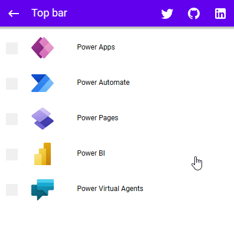

# App bar top

## Description

The top app bar provides content and actions related to the current screen. It’s used for branding, screen titles, navigation, and actions.

## Demo

## Custom properties

| property | description |
| --- | --- |
| titleText | `string` displayed text |
| svgIcon1/2/3/4 | `string` but in svg-code from `<svg> to </svg>` or `null` - use every svg, without setting the fill properties, it will automatically add color, if you leave an icon blank it will be invisible and the other icons adjust their position |
| onSelectIcon1/2/3/4 | `behavioural property` formulas you want to execute on the icons (left to right) |
| tooltipIcon1/2/3/4 | `string` tooltip of the icons |
| iconSize | `int` in px - size of all the icons |

## Tips and Tricks

* use the included icons from the template
* use icon1 for a menu or back button
* you can stack 2 bars on top of eachother to provide additional actions in a changed context (see gif)
* don't use the top bar at all if there is no benefit at all from using it 😉

## Known limitations

Becaus there is a box shadow, you have to overlap this 10 px to the next control to the bottom.

## Version

| Version | description |
| --- | --- |
| 1.0.0 | First version |

## Reference

https://m2.material.io/components/app-bars-top
