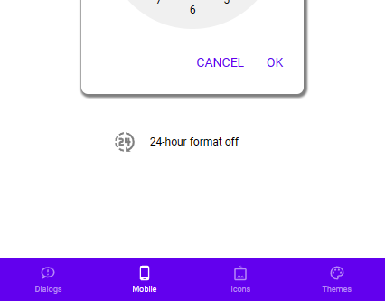

# Bottom Navigation

## Description

Navigate between screens on mobile devices.

## Demo

## Custom properties

| property | description |
| --- | --- |
| items | A `table` with the fields `id` (int), `svgIcon` (svg-Code as string), `title` (string) and `screen` (if you want to navigate) |
| iconSize | `int` in px - size of the svg-Icons |
| navigate | `bool` to control if a click on the menu items navigate to the specified screen |
| onSelect | Everything else that should happen on the click of the menu item, best used with `Switch(ThisItem.id, 1, FirstButtonOnSelectAction, 2, ...)` |

## Tips and Tricks

* switch between Navigation Drawer and Bottom Navigation on size breakpoints, when building responsive apps
* don't use more than five items

## Known limitations

* none

## Version

| Version | description |
| --- | --- |
| 1.0.0 | First version |

## Reference

https://m2.material.io/components/bottom-navigation
