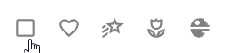

# Checkbox

## Description

Checkboxes allow users to select one or more items from a set. Checkboxes can turn an option on or off.

## Demo

## Custom properties

| property | description |
| --- | --- |
| default | `bool` default state of the checkbox |
| onSelect | `behavioural property` formulas you want to execute when selecting th checkbox |
| outsideMargin | `int` in px - margin to all sides of the checkbox, which allows easy spacing with other elements |
| svgIconFull | `string` icon in checked state - provide svg-code without fill, will be in primaryColor when checked |
| svgIconEmpty | `string` icon in unchecked state - provide svg-code without fill, will be in disabledColor when unchecked |

## Tips and Tricks

* the regular checkbox also looks pretty nice with the template
* also use this for other icons (see examples above) - many icons have an outline version

## Known limitations

* default-value doesn't work in demo app, but works in new projects 🤷

## Version

| Version | description |
| --- | --- |
| 1.0.0 | First version |

## Reference

https://m2.material.io/components/checkboxes
