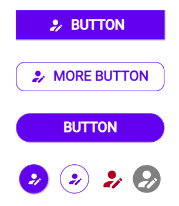

# Button

## Description

THE BUTTON - An element you will use in every app. While the standard PowerApps button has a lot of styling options this one cuts it down to only a few, letting you quickly add an SVG image to the button or Display it as an outline button.

## Demo

## Custom properties

| property | description |
| --- | --- |
| onSelect | `behavioural property` formulas you want to execute on the button |
| outlinedButton | `bool` reverse colors of the button (including icon) |
| boxshadow | `bool` puts a very subtle gray boxshadow behind the button |
| outsideMargin | `int` in px - margin to all sides of the button, which allows easy spacing with other elements (don't use 0, otherwise ) |
| borderRadius | `int` in px - border radius of the button to display rectangular buttons (0), rounded edges (5-10) or pill buttons (100) |
| borderThickness | `int` in px - border thickness of the button - important on outline buttons |
| buttonText | `string` text on the Button, Material Design suggests to use CAPITAL LETTERS for buttons (we didn't force it by default), if you put nothing in there it will automatically center the icon |
| svgIcon | `string` but in svg-code from `<svg> to </svg>` or `null` - use every svg, without setting the fill properties, it will automatically add color, if you put nothing in there it will automatically center the text |
| iconSize | `float` (use something between 0.5-0.9) size of the icon in relation to the button height |
| align | `Align.Left` or `Align.Center` aligns the icon + text - you probably want to only use `Align.Left` if you have multiple buttons with icons underneath each other |
| adjustPaddingLeft | `int` in px - use to adjust, if Icon&Text are off-center. You can use negative numbers to move everything left |

## Tips and Tricks

* use the included icons from the template
* don't use boxshadow on outlined buttons, doesn't look too good
* you can use this to just display an icon, delete the text and set border
* use normal and outlined buttons together to highlight one option

## Known limitations

* sometimes the centering is off, use `adjustPaddingLeft` to manually adjust
* colors on the icon won't work for borders of svg elements, but most icons aren't built on that, make sure to not use any fill properties inside the svg

## Version

| Version | description |
| --- | --- |
| 1.0.0 | First version |

## Reference

https://material.io/components/buttons
