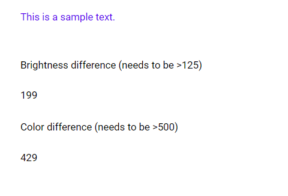

# Contrast Checker

## Description

The contrast checker is not for active use in your app, but to make sure, that your color choices match W3.org accessability criteria.

## Demo

## Custom properties

None

## Tips and Tricks

* see Reference-link for further info
* use this also to check other color combinations you use in your app

## Known limitations

None

## Version

| Version | description |
| --- | --- |
| 1.0.0 | First version |

## Reference

https://www.m365princess.com/blogs/color-contrast-ratio-checker/
