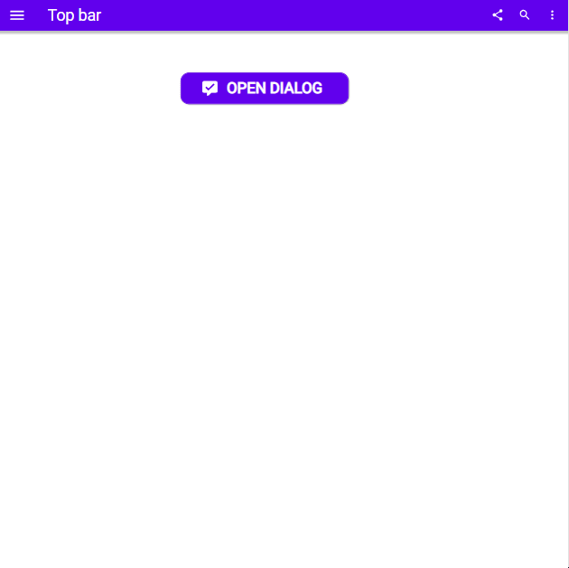

# Dialog

## Description

We've all spent too much time building confirmation dialogs in Power Apps, so here is the ultimate component for that purpose.Following Material Design guidelines this always presents 2 options. The dialog centers itself in both directions and automatically adjusts the height to its content.

## Demo

## Custom properties

| property | description |
| --- | --- |
| header | `string` optional, if not used the component adjusts in height |
| text | `string` main text of the dialog |
| action1/2text | `string` available actions, Material Design puts these in CAPITAL LETTERS, button width auto adjusts |
| action1/2onSelect | `behavioural Property` - onSelect actions of the 2 buttons |
| dialogWidth | `int` in px - width of the dialog, height auto adjusts |
| boxShadow | `bool` - places a subtle box shadow around the dialog |

## Tips and Tricks

* put the visible property of the component to a local variable
* don't forget to put the visibility to false on both buttons
* use the dialog only when immediate action has to be taken by the user - other options are the snackbar and the banner, see the Material Design reference for more guidance how to use each of them

## Known limitations

Because the labels and therefore height of the inner container (the actual dialog) is set to auto-height, the height sometimes bugs. To make sure that doesn't happen, use a `Reset(Dialog)` at some point

## Version

| Version | description |
| --- | --- |
| 1.0.0 | First version |

## Reference

https://material.io/components/dialogs
