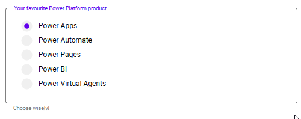

# Generic Input Frame

## Description

This is an element to create your own forms. This has to be paired with other input elements, that will sit on top of it.
The input frame matches the outlined text input.

## Demo

## Custom properties

| property | description |
| --- | --- |
| labelText | `string` text in the top left corner of the outline - displayed in primaryColor |
| helperText | `string` text underneath the outline - displayed in disabledColor |
| errorText | `string` text displayed in case of isError - displayed in errorColor |
| outsideMargin | `int` in px - margin to all sides of the button, which allows easy spacing with other elements (don't use 0, otherwise ) |
| borderRadius | `int` in px - border radius of the outline |
| isError | `bool` specify error condition in here |
| showErrors | `bool` several colors turn to the specified errorColor, if isError AND showErrors are true |

## Tips and Tricks

* use the isError-property to store your error-condition and reuse in other parts of your app if necessary
* set showErrors initially to `false` and only start showing, after the first blocked submit, so nobody is greeted by red fields
* match the error-color to your input control (see example)

## Known limitations

* none

## Version

| Version | description |
| --- | --- |
| 1.0.0 | First version |
