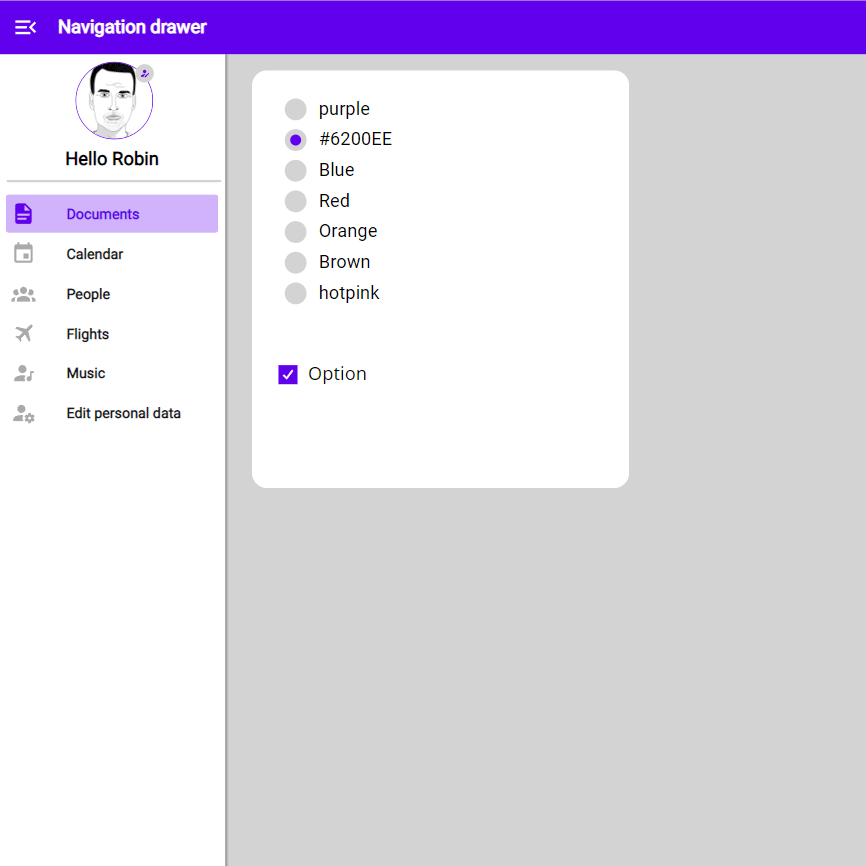

# Navigation Drawer

## Description

An expandable sidebar with your menu items, that can be repeated on every screen. If retracted only the icons show

## Demo

## Custom properties

| property | description |
| --- | --- |
| items | A `table` with the fields `id` (int), `svgIcon` (svg-Code as string), `title` (string) and `screen` (if you want to navigate) |
| expandSidebar | A `bool` that controls if you want to expand (show icon and text) or retract (show only icon) the drawer |
| topMargin | `int` for the space you want before the menu items start. Can be used creatively, to place a container in the expanded state (see example)
| navigate | `bool` to control if a click on the menu items navigate to the specified screen |
| onSelect | Everything else that should happen on the click of the menu item, best used with `Switch(ThisItem.id, 1, FirstButtonOnSelectAction, 2, ...)` |

## Tips and Tricks

* The top bar in the example with the button to expand/retract is not part of the component
* if you want to use the `topMargin` only in expanded mode, look at the demo app how it is set up, don't hesitate to directly add it to your version of the component
* you can also add a section with options beneath the navigation items (see the reference link for examples)
* get creative!

## Known limitations

None

## Version

| Version | description |
| --- | --- |
| 1.0.0 | First version |

## Reference

https://m2.material.io/components/navigation-drawer
