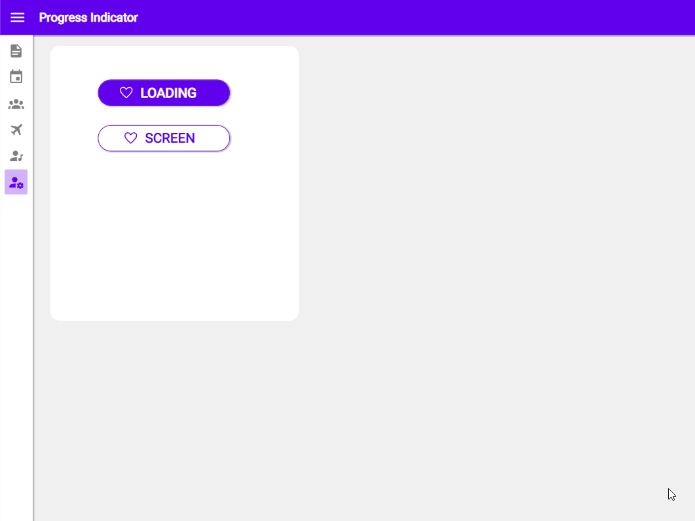

# Progress Indicator

## Description

The Progress indicator expresses an unspecified wait time.

## Demo

## Custom properties

| property | description |
| --- | --- |
| transitionStart| `bool` put your Visible-variable or `Self.Visible` in here to start the animation |

## Tips and Tricks

* if you have functions, that take a few seconds to process use this indicator to show the user something is going on in the background
* at the start of your code, set the indicator to visible, in the end set it to invisible
* place the indicator right beneath your top bar

## Known limitations

None

## Version

| Version | description |
| --- | --- |
| 1.0.0 | First version |

## Reference

https://material.io/components/progress-indicators
