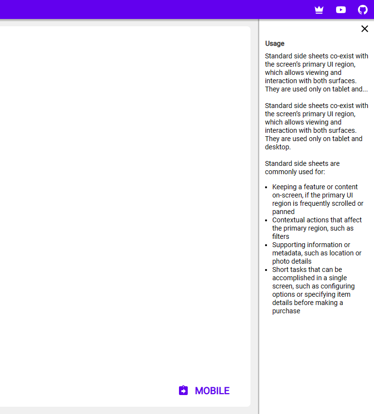

# Side sheet

## Description

Side sheets are surfaces containing supplementary content that are anchored to the right edge of the screen.
You have to provide the content, buttons/text/input elements are not part of the component. 

## Demo

## Custom properties

| property | description |
| --- | --- |
| onClose | `behavioural property` formulas you want to execute when clicking on the close icon |
| iconSize | `int` in px, size of th close icon |
| title | `string` title on top |
| adjustPaddingLeft | `int` in px - use to adjust, if Icon & Text are off-center. You can use negative numbers to move everything left |

## Tips and Tricks

* add your own content underneath the title
* pack component & content into a container

## Known limitations

* none

## Version

| Version | description |
| --- | --- |
| 1.0.0 | First version |

## Reference

https://m2.material.io/components/sheets-side
