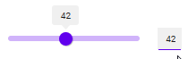

# Slider

## Description

Sliders allow users to make selections from a range of values.

## Demo

## Custom properties

| property | description |
| --- | --- |
| valueDefault | `int` default position of the slider |
| valueMin | `int` minimum selectable value |
| valueMax | `int` maximum selectable value |
| toggleSize | `int` in px - size of the toggle circle |
| lineSize | `int` in px - strength of the line |
| outsideMargin | `int` in px - margin to all sides of the button, which allows easy spacing with other elements (don't use 0, otherwise ) |
| showInputLabel | `bool` show additional label to input text via keyboard |
| showLabel | `bool` display current value on a label on top of the toggle |

## Known limitations

* none

## Version

| Version | description |
| --- | --- |
| 1.0.0 | First version |

## Reference

https://m2.material.io/components/sliders
