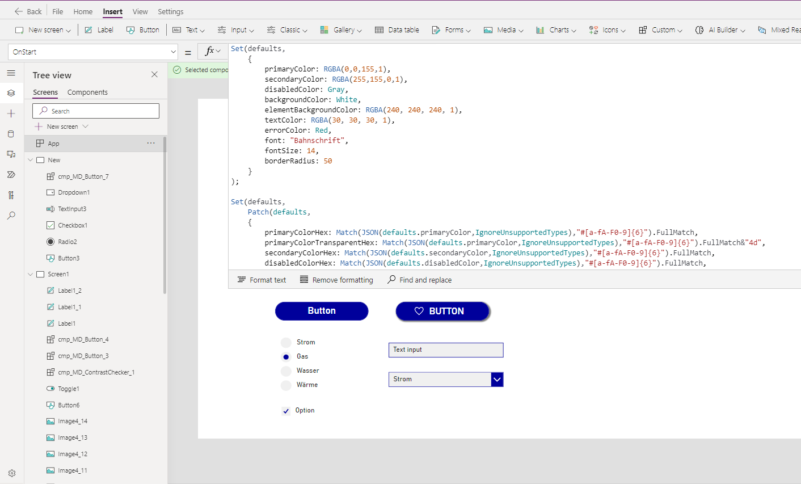

# Template

## Description

The template should be your starting point for every new app. There are a few major and several minor differences to a normal empty canvas app.

1. All the necessary variables to define the colors and appearance of the components are stored in the **OnStart** -property of the app.
If you want a "normal" theme, just change the primaryColor and you are good to go.
2. Many absolute values in new elements (buttons, textinputs, labels, etc.) are exchanged for the variables that are defined in the **OnStart**-property. Example: The standard **Fill** -property of a Button is `RGBA(56, 96, 178, 1)`, in the template it should be `defaults.primaryColor`. Therefore the standard elements match the components from the get go and you don't have to touch too many properties manually and can adjust them afterwards (change your primaryColor in the **OnStart** and the whole app should match that color).
3. There is a collection of ~6000 svg-Icons which is called `MaterialDesignIcons`. You can access them like this: `LookUp(MaterialDesignIcons, name="death-star", svgPath)`. Look at the demo app for examples in image controls or the components.
4. Many elements have their properties changed up a little bit to match the Material Design theme as closely as possible (some work better than others)

## Setup

1. Download the [msapp-file](../solution/MD_Template_v1_1.msapp)
2. Navigate to [make.powerapps.com](https://make.powerapps.com)
3. Select your environment
4. Select **Create**
5. Select **Dataverse** or **SharePoint** or **Excel** (doesn't matter, we won't actually use that -  ⚠️ don't click **Blank app**)
6. Select **Open**
7. Select the `.msapp-File` from your file system
8. Save under new name
9. Add the app to your solution (you don't work in solutions? - go start now!)

## Demo

New controls and components from the library should automatically match your specified colors

## Tips and Tricks

* The first part of the **OnStart**-property is where you input the colors and settings you want to use. Some colors are calculated again in Hex-code to style the SVG-icons. You can use them inside html-Controls or svg-Images.
* You can introduce different themes like high contrast or dark mode and let the user choose which one they want to use (see examples)
* Delete the items from the data-tab if you don't use them, the size of the data source is roughly 700 kB
* if you want to use the template file for Custom Pages in Model Driven Apps [download the Solution that contains only a Custom Page](../solution/MaterialDesignCustomPage_1_0_0_3.zip)

## Known limitations

* When changing colors in the OnStart-property sometimes the whole OnStart-property throws an error. Simply change all colors, save and reload the app and everything is back to normal
* When creating/editing components inside the template you have to enable to access App scope, otherwise all element properties throw errors
* You have to manually import the library components each time you start a new app, otherwise the components are not linked to the component library in your environment and you won't be able to update
* Don't use the demo app as template for aforementioned reason

## Version

| Version | description |
| --- | --- |
| 1.0.0 | First version |

## Reference and credit

The techniques to create this template were discovered by [Sancho Harker](https://twitter.com/iAm_ManCat). Show him some love and tip him a coffee via paypal, if you can afford it. This will save you soooo much time!

If you want to learn more visit [his blog](https://www.iammancat.dev/2022/01/power-apps-branding-template-v3/)

The icons used in the template are imported from https://materialdesignicons.com/ through this repository https://github.com/Templarian/MaterialDesign
These are partially the original Material Design icons and partially user created in the same style, check the homepage for more information.
