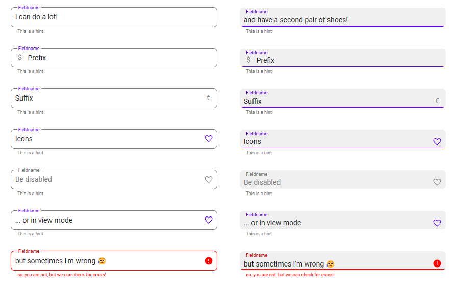

# Text Input

## Description

Text fields allow users to enter text into a UI. They typically appear in forms and dialogs.

## Demo

## Custom properties

| property | description |
| --- | --- |
| onSelect | `behavioural property` formulas you want to execute when selecting the text input |
| onChange | `behavioural property` formulas you want to execute when changing the input |
| outLined | `bool` outlined or filled version |
| defaultValue | `string` default string in the text input |
| maxLength | `int` maximum length of input string, you can't continue typing if length is reached (0 disables this) |
| maxLengthVisible | `bool` display current & maximum length of input string on the bottom right |
| prefixText | `string` text that is displayed in the beginning of the field (in disabledColor) |
| suffixText | `string` text that is displayed in the end of the field (in disabledColor) |
| svgTrailingIcon | `string` svg-code for icon that is displayed in the end of the textbox - space is freed up, if property is empty |
| showTrailingIcon | `bool` set a condition when to show the trailing icon |
| iconSize | `int` in px, size of the trailing icon |
| iconColorHex | `string` color of the icon (can use a condition here) |
| align | `string` alignment of the text |
| delayOutput | `bool` same as the delay output property on the regular textbox to not trigger API calls on every change |
| borderRadius | `int` in px - border radius of the outline |
| labelText | `string` text in the top left corner of the outline - displayed in primaryColor |
| helperText | `string` text underneath the outline - displayed in disabledColor |
| errorText | `string` text displayed in case of isError - displayed in errorColor |
| outsideMargin | `int` in px - margin to all sides of the button, which allows easy spacing with other elements (don't use 0, otherwise ) |
| borderRadius | `int` in px - border radius of the outline |
| isError | `bool` specify error condition in here |
| showErrors | `bool` several colors turn to the specified errorColor, if isError AND showErrors are true |

## Tips and Tricks

* use the isError-property to store your error-condition and reuse in other parts of your app if necessary
* set showErrors initially to `false` and only start showing, after the first blocked submit, so nobody is greeted by red fields

## Known limitations

* none

## Version

| Version | description |
| --- | --- |
| 1.0.0 | First version |

## Reference

https://m2.material.io/components/text-fields
