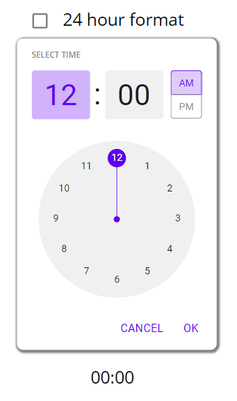

# Timepicker

## Description

Time pickers allow users to enter a specific time value. They can be used for a wide range of scenarios.

Common use cases include:

* Setting an alarm
* Scheduling a meeting
Mobile time pickers are displayed in dialogs and can be used to select hours, minutes, and a period of time.

## Demo

## Custom properties

| property | description |
| --- | --- |
| header | `string` title above the timepicker |
| action1/2text | `string` available actions, Material Desing puts these in CAPITAL LETTERS, button width auto adjusts |
| action1/2onSelect | `behavioural Property` - onSelect actions of the 2 buttons |
| format | `int` enter `12` for AM/PM or `24` for a 24h input format  |
| defaultTime | `time` initial time displayed on the picker  |
| boxShadow | `bool` displays a subtle boxShadow around the picker |
| selectedTime (output) | `time` outputs the selected time |

## Tips and Tricks

* primarily for mobile use, but also helps on desktop

## Known limitations

* none

## Version

| Version | description |
| --- | --- |
| 1.0.0 | First version |

## Reference

https://m2.material.io/components/time-pickers
